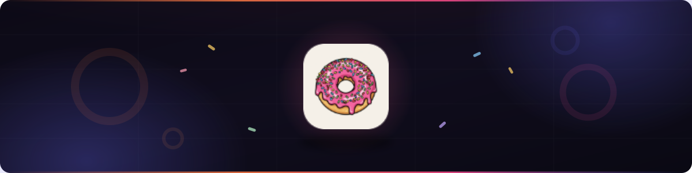

# Donut Me

**Accept stablecoins with a single link — non-custodial, multi-chain, gasless.**

[Website](https://donut.me) · [Documentation](https://donut.me/docs)

---

## What is Donut Me?

Donut Me is a crypto **payment-link platform**. Create a payment plan, share a link (or your public storefront), and buyers pay stablecoins (**USDC / USDT**) across EVM chains — settling **directly to your wallet**. Every confirmed payment fires a **signed webhook**, so you can unlock anything: a Telegram channel, a download, an API key.

> As easy as buying someone a donut. 🍩

## How it works

1. **Create a plan** — fixed price or pay-what-you-want.
2. **Share the link** — `donut.me/pay/<id>`, or your storefront at `donut.me/<slug>`.
3. **Buyer pays in one signature** — connect wallet, pay via Permit2.
4. **You get a webhook** — on-chain verified `payment.confirmed`.

## Why Donut Me?

- 🏦 **Non-custodial** — funds settle straight to your wallet
- ✍️ **Gasless** — Permit2: one signature, no separate approval
- ⛓️ **Multi-chain** — USDC / USDT on Ethereum, Polygon, Arbitrum, Base & BSC
- 🏪 **Self-serve storefront** — a branded page at `donut.me/<slug>`, no website needed
- ⚡ **Real-time** — live checkout status and dashboard
- 🔒 **Safe by design** — Permit2 binds the exact amount, token & recipient

## Security

Smart contracts built on **OpenZeppelin v5** — ReentrancyGuard, Pausable, Ownable2Step, SafeERC20, a token allowlist, and per-payment session-replay protection. Non-custodial end to end; a third-party audit is planned.

---

**Built with 🍩 by the Donut Me team**

*Making crypto payments as easy as buying a donut.*

